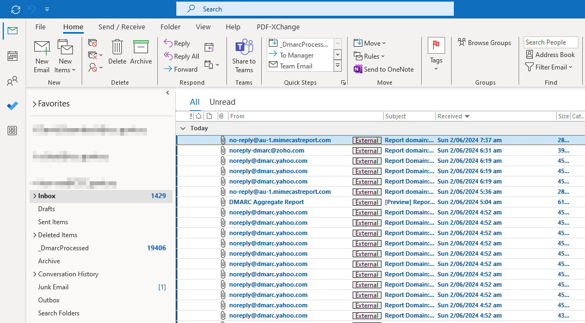
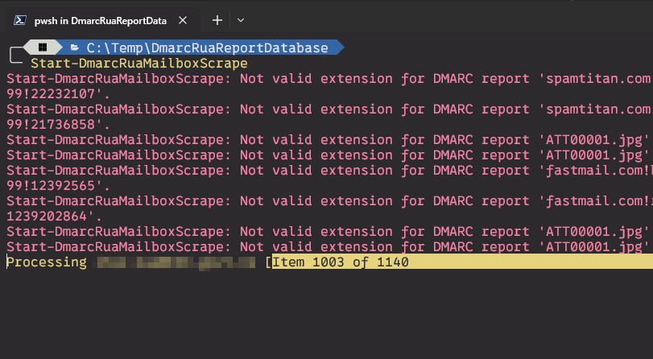
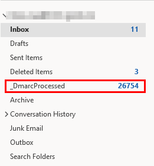
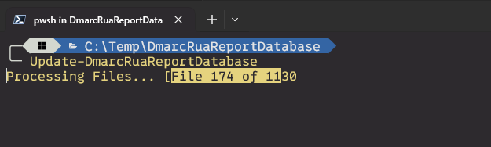
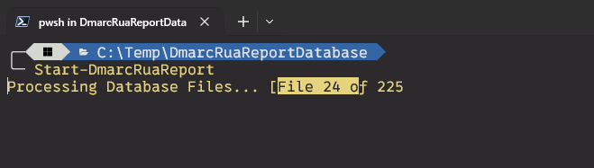
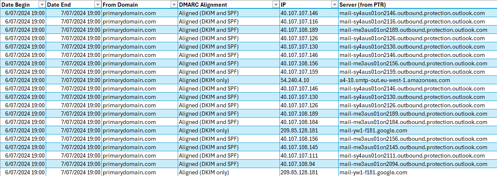
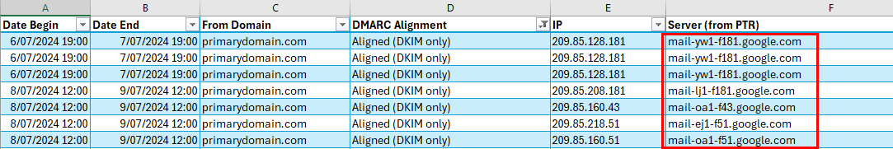
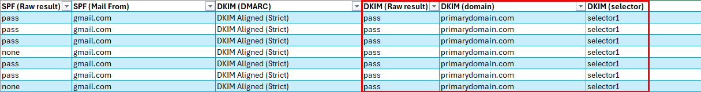

A PowerShell module used to collect and parse a large number of XML based DMARC RUA report files into a simple to read CSV based spreadsheet.  
These reports can then be used to assist in the implementation of a DMARC reject policy for your domains.

# Overview
Email spoofing is a common technique used to trick users into thinking an email has come from a trusted source and is often used to increase the success rate of a spam or spear-phishing campaign.  

Commonly spoofed individuals include the CEO, CFO and Senior Managers, and can be used for defrauding the business, customers and any 3rd party supplies.
There are 3 x open standards used to prevent email spoofing: 
- SPF
- DKIM
- DMARC

Whilst SPF and DKIM have seen widespread adoption the same cannot be said for DMARC, which is a shame because DMARC provides the reporting capabilities to help you identify:
- Who and what is sending emails using your domains?
- Are these emails authenticated with SPF, DKIM or both?
- What would get blocked if I went straight to a DMARC Reject policy?

In response to the slow implementation, several corporations have formed around the idea of offering DMARC as a service, where they will collect all the DMARC reports on your behalf and then convert them into a nice, easy to read format.
Some of these services come with a hefty monthly price tag, which is what led me to write this PowerShell module that will:
1. Download DMARC RUA reports from your regular Outlook based mailbox.
2. Parse the XML based reports.
3. Output the report as a nice, simple to read CSV file.

What's more, if you decide you don't like this module and would prefer to pay another company to manage DMARC on your behalf, you can simple copy the reports you've processed and upload them to your new system.

# Getting started

To get started:
- Download DmarcRuaReporting from [GitHub](https://github.com/DelectableMechanisations/DmarcRuaReporting/Releases).
  Then unzip it to your private PowerShell Modules directory:
  `"$([System.Environment]::GetFolderPath('MyDocuments'))\PowerShell\Modules"`

- To confirm the module has been been installed, run the command below:

```powershell
Get-Module -ListAvailable DmarcRuaReporting
```

## Prerequisites

- Powershell 7.4 or higher
- 7-Zip
- Microsoft Outlook (tested using the M365 version of Outlook)
- Microsoft Exchange Online hosted mailbox
- Access and rights to modify your public DNS records
- At least 5 GB of free space

# How to use
This section provides a quick overview of how you can setup DMARC in monitoring mode for all your domains.  
You will quickly start collecting reports and be able to use this module to download and parse them into an easy to read CSV based format.

## ( 1 )&emsp;Create a new mailbox to receive the DMARC RUA reports
Create one new mailbox in Exchange Online and grant yourself FullAccess permissions to it.
This should be dedicated to collecting the RUA reports and shouldn't be used for any other purpose.  
We will use <rua@primarydomain.com> throughout this example.

## ( 2 )&emsp;Enable DMARC monitoring mode for all your public domains
To enable DMARC for your domains, you will need to publish a DMARC policy record in the root of each one.

### Single Public Domain
If you have a single public domain then you only need a single DMARC policy record.
e.g. If you public domain is "primarydomain.com" then you would create the following TXT record:
```
_dmarc.primarydomain.com    TXT    v=DMARC1; p=none; rua=mailto:rua@primarydomain.com
```
When another email system processes emails sent from one of your *@primarydomain.com based email addresses, this record instructs them to send DMARC RUA reports to the mailbox <rua@primarydomain.com>.  
As the policy is set to "none", this effectively tells the other email system that this domain is using DMARC for monitoring purposes only and no further DMARC related validation should take place.

### Multiple Public Domains
If you have more than one public domain, you will need 2 x DMARC records to allow the mailbox to receive DMARC RUA reports.
e.g. In this example:
* primarydomain.com is your primary domain
* secondarydomain.com is your secondary domain
* <rua@primarydomain.com> is your DMARC RUA mailbox

To enable DMARC for your primary domain you would create the following TXT record:
```
_dmarc.primarydomain.com    TXT    v=DMARC1; p=none; rua=mailto:rua@primarydomain.com
```
To enable DMARC for your secondary domain you would create the following TXT record:
```
_dmarc.secondarydomain.com    TXT    v=DMARC1; p=none; rua=mailto:rua@primarydomain.com
```
To allow your primary domain to accept DMARC RUA report emails from your secondary domain, an additional DMARC record will need to be created in your primary domain:
```
secondarydomain.com._report._dmarc.primarydomain.com    TXT    v=DMARC1;
```
This record essentially allows the "primarydomain.com" domain to receive DMARC RUA reports from the "secondarydomain.com" domain

## ( 3 )&emsp;Wait until the mailbox starts receiving reports
Each time an email system processes an email sent from one of your domains, it will make a note of several characteristics including:
* IP address of the system that sent the email.
* SPF validation status.
* DKIM selector(s) used to sign the email and that status of the DKIM signature(s).

Typically, every 24 hours the email system will compile these details into an aggregate report and send it to your DMARC RUA mailbox as an attachment.


## ( 4 )&emsp;Create a new DMARC Reporting Database
The DMARC Reporting Database is a place to store all the files downloaded from your DMARC RUA mailbox and the CSV based reports that are generated from them.
The `New-DmarcRuaReportDatabase` function is used to create the basic folder structure of the database.

```powershell
New-DmarcRuaReportDatabase -Path 'C:\Temp' -OutlookMailboxesToScrape 'rua@primarydomain.com'
```

## ( 5 )&emsp;Open Microsoft Outlook
Open Microsoft Outlook and wait for it to finish syncing all the latest emails.

## ( 6 )&emsp;Scrape the DMARC RUA mailbox
Return to PowerShell and run the `Start-DmarcRuaMailboxScrape` function.
```powershell
Start-DmarcRuaMailboxScrape
```
Any emails that don't contain attachments will be ignored, as will any emails with attachments that don't have an accepted file extension (.7z .gz .rar .tar .x .zip).
  
Emails that have been processed are moved into the "_DmarcProcess" Outlook folder:  


## ( 7 )&emsp;Update the DMARC Reporting Database.
In the previous step, all the email attachments were downloaded and saved to the `.\ImportData` subfolder in your database.
These are still in their original compressed format and need to be expanded, and this is what the  `Update-DmarcRuaReportDatabase` function is for.
```powershell
Update-DmarcRuaReportDatabase
```
Depending on the number of email attachments you downloaded, this could take some time.
  

## ( 8 )&emsp;Generate the CSV based reports
In the previous step, all the email attachments were unzipped, the XML based reports were parsed and imported into the database.
The next step is to run the `Start-DmarcRuaReport` function to generate the CSV based reports.
```powershell
Start-DmarcRuaReport
```
By default, this function will only generate a reports based on emails sent in the last 3 months.


Use the `-StartDate` parameter to specify a custom timeframe:
```powershell
Start-DmarcRuaReport -StartDate (Get-Date).AddDays(-14)
```
## ( 9 )&emsp;Generate the CSV based reports
Open the "Reports" folder and review its contents.
You should have a report for every domain you've configured for DMARC.
You may even have reports for subdomains you didn't know had been configured to send email:


If a report for one of your domains doesn't appear, it could be that the domain doesn't send email or hasn't sent any emails in the time since you enabled DMARC monitoring mode for it.

## ( 10 )&emsp;Review the reports in Microsoft Excel
Open one of the report files in Excel, insert a table and you're ready to start investigating.



# Tips
Speaking from experience, moving an organisation from no DMARC policy at all to "reject" isn't easy.  
It requires a lot of work, following breadcrumbs, organising meetings with non-technical staff and explaining to them why you need to do this.

## All emails with a "DMARC Alignment" set to "Aligned (DKIM and SPF)" can be filtered out.
These are already fully compliant with DMARC and require no further action.

Whilst I would recommend trying to get as many systems authenticating using both DKIM and SPF, it isn't mandatory and sometimes isn't possible as not all systems support both.
To pass DMARC validation, emails must be align on either DKIM or SPF.
Aligning on both just gives you an extra level of security in the event that one of them fails.
e.g. I am 100% certain that I don't have any legitimate services sending email from Gmail, yet the example below shows an email sent from Gmail that aligns on DKIM.  
How is this possible?


Well, as the DKIM check passed and aligned on primarydomain.com and the DKIM selector is "selector1", this indicates to me that these emails were originally sent from Exchange Online (their selectors are imaginitively named "selector1" and "selector2") to Gmail.
Once these emails hit the Gmail, an auto-forward on the mailboxes forwarded them back out to another email address.
As auto-forwarding breaks SPF alignment, the emails had to rely on their DKIM signature to align and pass DMARC validation.

If Exchange Online had only been configured with SPF and the DMARC policy had been "quarantine" or "reject", these emails would have failed DMARC alignment and been quarantined or rejected.

## Implement Email Segmentation using subdomains
Don't use your root domain for sending out all your emails.
It becomes very difficult to manage and you start running into issues if your SPF record gets too long or has too many DNS lookups.
Instead, I recommend assigning each email sending system (where practical) its own unique subdomain.
e.g.
- Your primary email system (e.g. Exchange Online) should be allowed to send using your root domain.
- Your marketing team's bulk email system should use something like newsletter.primarydomain.com or hello.primarydomain.com.
- If your website sends emails, it should use something like website.primarydomain.com or forms.primarydomain.com.
- If you have another website with its own unique domain that doesn't use anything else, then I'm usually ok with it using that root domain for sending email (e.g. secondarydomain.com).
- Use descriptive DKIM selector names where possible. A DKIM selector of "salesforce" is much easier to tie back to a system than "6h6z18dj9s7jbjlnbi9j8958w3t33z5w" (Amazon SES is the worst culprit for this).
- If your DNS provider supports it, tag your DKIM selectors with the name and purpose of the system that uses it.

### Reference
https://www.m3aawg.org/sites/default/files/m3aawg-sendingdomains10102019nk-2.pdf
